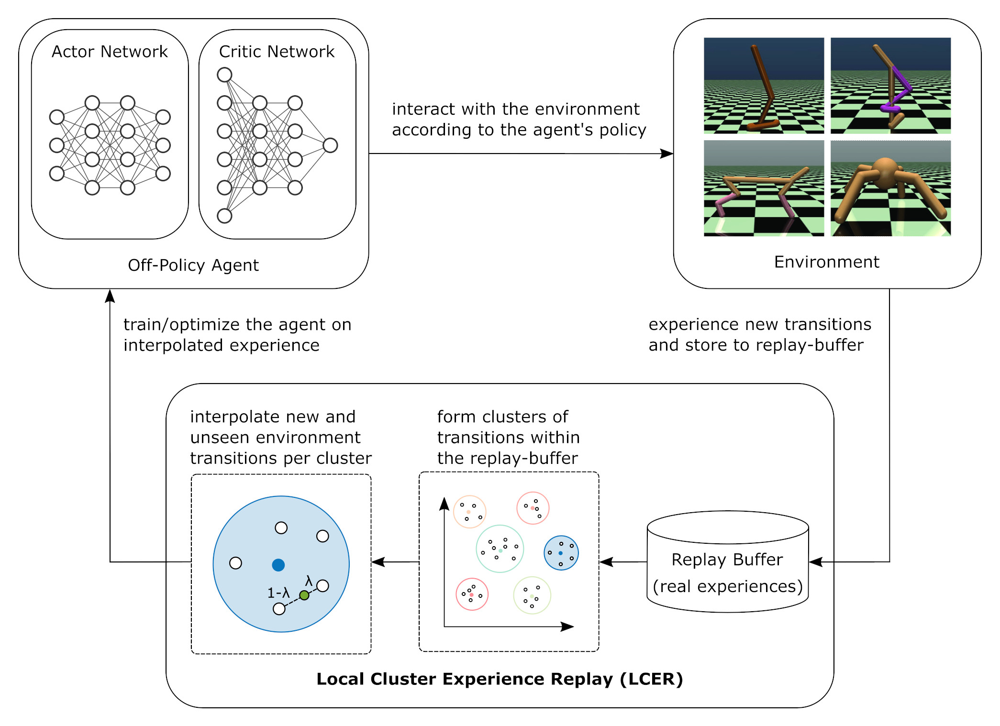
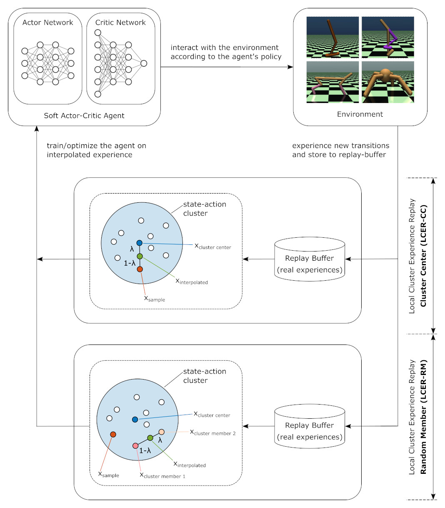
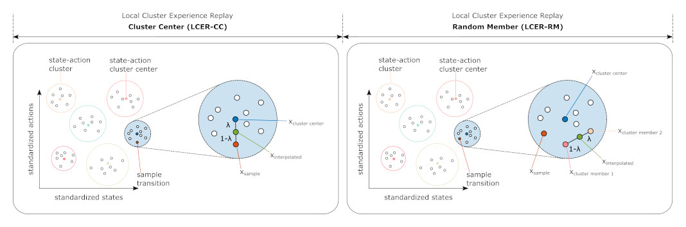

[](https://github.com/szahlner/lcer/actions/workflows/ci.yml)
[](LICENSE)
[](https://github.com/psf/black)

# Local Cluster Experience Replay (LCER)

## Overview 

LCER is an extension for replay-buffers to increase the sample efficiency of off-policy reinforcement learning algorithms. The goal is to reduce the number of required interactions with the environment to maximize the cumulative reward. LCER introduces k-Means clustering and mix-up sampling to the replay-buffer. It forms clusters within the replay-buffer and interpolates new, unseen environment interactions that are used in the training process of the RL agent. The following figure schematically depicts LCER from a higher-level perspective.

 
 
To keep the additional overhead in terms of implementation effort and computational
power at a minimum, LCER is designed as a wrapper around the standard replay-buffer. The following figure depicts a schematic representation of LCER and its two variants LCER - Cluster Center (LCER-CC) and LCER - Random Member (LCER-RM). The same figure also shows that we use Soft Actor-Critic RL agents in our implementation.

  

The experience, generated by the agent while interacting with the environment, is collected and stored in a replay-buffer. To train the agent, a sample transition is randomly chosen from the replay-buffer and assigned to a cluster in the z-space (standardized state-action coordinates).

**LCER-CC**: A new transition is created by interpolation between the sample transition and its assigned cluster center, using mix-up sampling.

**LCER-RM**: A new transition is created by interpolation between two transitions from the same cluster as the sample transition belongs to, using mix-up sampling. 

The following figure depicts both implementations in detail.

  

## Installation

### Prerequisites

LCER requires Python 3.7+.  
**Note**: it is only tested with Python 3.7.

### From Source

```bash
git clone https://github.com/szahlner/lcer.git
pip install -e lcer
```

## Docker Images

Build docker image for CPU:
```bash
make docker-cpu
```

Build docker image for GPU:
```bash
make docker-gpu
```

Pull built docker image for CPU:
```bash
docker pull szahlner/lcer-cpu:latest
```

Pull built docker image for GPU:
```bash
docker pull szahlner/lcer:latest
```

After starting the container, make sure to run the update-script `./update` from within the `WORKDIR` to ensure to use the latest version of LCER.

## Tests

To run tests, first install pytest, then:
```bash
make pytest
```

or 

```bash
python -m pytest
```

## Run Experiments

### Local

Start the training script

```bash
python train.py
```

### From a Docker Image

Run the container

```bash
# Run container with gpus enabled
host@host: docker run -it --gpus all szahlner/lcer:latest
```

Update to the latest version of LCER and start the training script

```bash
# Update
container@container: ./update.sh
# Change to lcer
container@container: cd lcer
# Run training script
container@container: python train.py
```

### Parameters

For a detailed list of all parameters, use

```bash
python train.py --help
```

## Citing the Project

To cite this repository in publications:

```bibtex
@misc{lcer,
    author = {Zahlner, Stefan},
    title = {Local Cluster Experience Replay (LCER)},
    year = {2022},
    publisher = {GitHub},
    journal = {GitHub repository},
    howpublished = {\url{https://github.com/szahlner/lcer}},
}
```

## Credits

### Idea

The idea is inspired by and therefore has a close connection to the implementation of [Sander - Neighborhood Mixup Experience Replay (NMER)](https://github.com/rmsander/interreplay), although there are clear differences in the utilized methods.  

### Code

**Logger** is based on [OpenAI Spinning Up - Logger](https://spinningup.openai.com/en/latest/utils/logger.html?highlight=logger).  
**HER** is widely inspired by [TianhongDai - Hindsight Experience Replay (HER)](https://github.com/TianhongDai/hindsight-experience-replay).  
**SAC** and **HER+SAC** is based on [pranz24 - pytorch-soft-actor-critic](https://github.com/pranz24/pytorch-soft-actor-critic).  
**World model** or **MDP dynamics model** is inspired by [Xingyu-Lin - mbpo_pytorch](https://github.com/Xingyu-Lin/mbpo_pytorch).  
A lot of the **code structure**, especially the **make** related part, is based on [DLR-RM - Stable Baselines3](https://github.com/DLR-RM/stable-baselines3) and [DLR-RM - RL Baselines3 Zoo](https://github.com/DLR-RM/rl-baselines3-zoo).